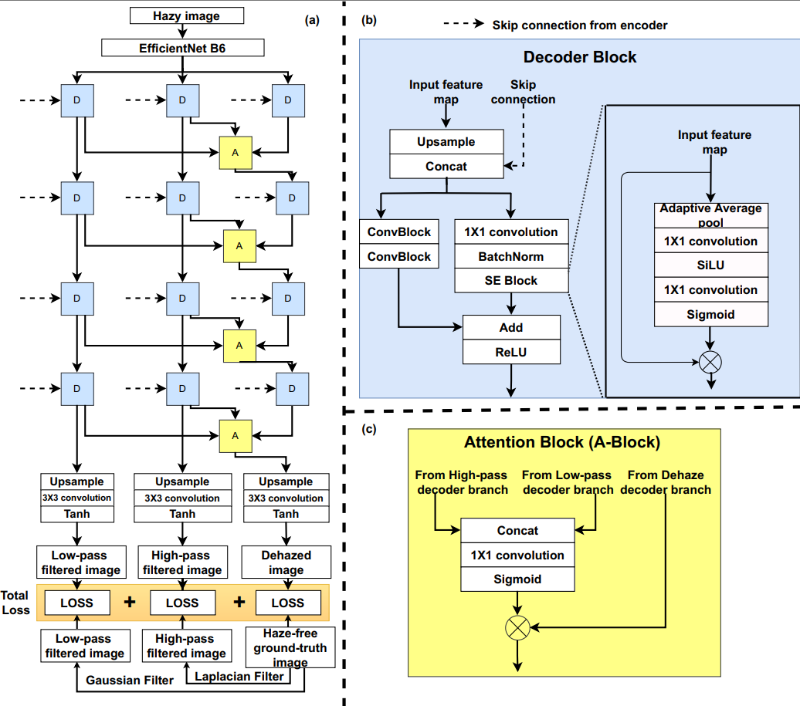
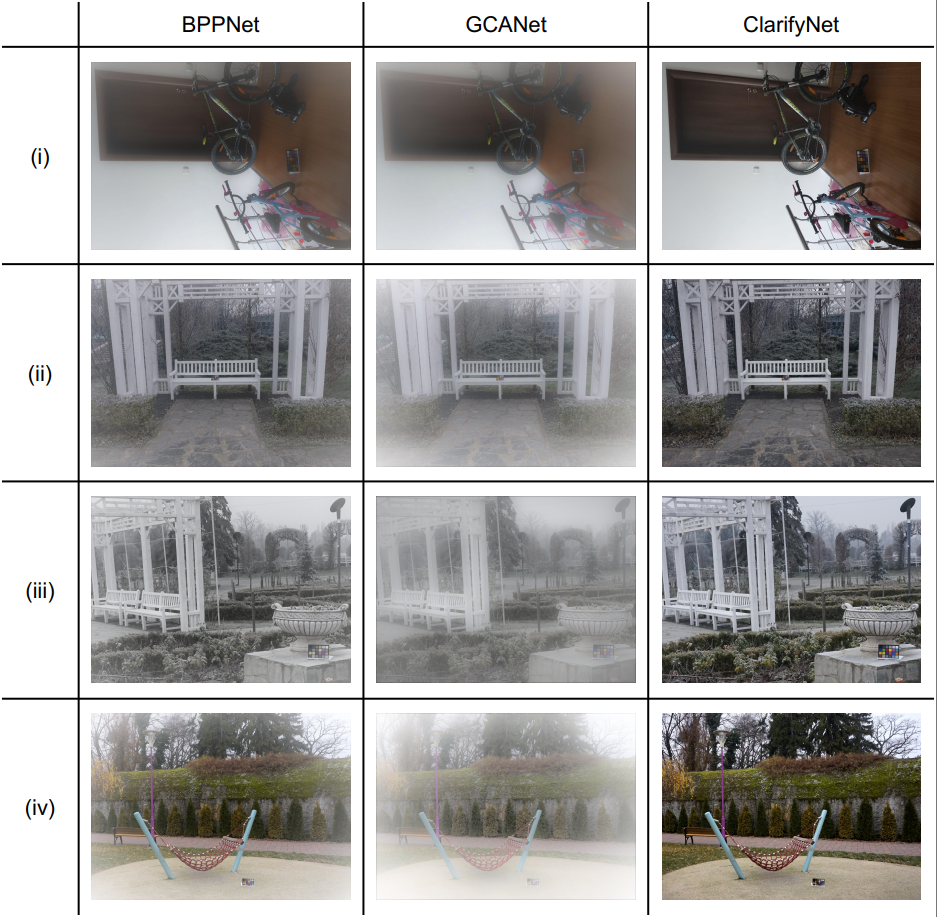
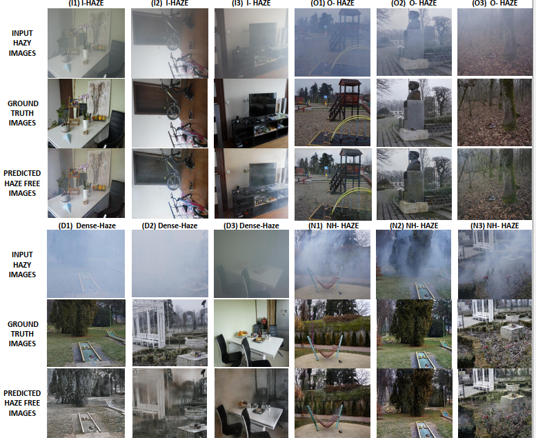

ClarifyNet: A High-Pass and Low-Pass Filtering Based CNN for Single Image Dehazing
==============================

This repository contains the source code of our paper, ClarifyNet (publication inprogress in <a href="https://www.sciencedirect.com/journal/journal-of-systems-architecture">Journal of Systems Architecture</a>).

Dehazing refers to removing the haze and restoring the details from hazy images. In this paper, we propose ClarifyNet, a novel, end-to-end trainable, convolutional neural network architecture for single image dehazing. We note that a high-pass filter detects sharp edges, texture, and other fine details in the image, whereas a low-pass filter detects color and contrast information. Based on this observation, our key idea is to train ClarifyNet on ground-truth haze-free images, low-pass filtered images, and high-pass filtered images. We comprehensively evaluate ClarifyNet on I-HAZE, O-HAZE, Dense-Haze, and NH-HAZE datasets using PSNR and SSIM metrics and compare them with previous works. On Dense-Haze and NH-HAZE datasets, ClarifyNet achieves the highest PSNR and SSIM. For I-HAZE and O-HAZE, ClarifyNet achieves the highest PSNR and remains within the top three techniques on the SSIM metric. ClarifyNet has a model size of 71MB and an inference latency of 1.5 seconds for dehazing an image of size 3996×4096.



## Sample Results
<hr>

<p align="center"></p>

Visualization of ClarifyNet results on I-HAZE (I1 to I3), O-HAZE (O1 to O3), Dense-Haze (D1 to D3),
and NH-HAZE (N1 to N3) datasets

<p align="center"></p>

Project Organization
------------

    ├── LICENSE
    ├── README.md          <- The top-level README for developers using this project.
    ├── data               <- The final, canonical data sets for modeling.
    │
    ├── requirements.txt   <- The requirements file for reproducing the analysis environment.
    │
    ├── src                <- Source code for use in this project.
    │   ├── __init__.py    <- Makes src a Python module
    │   ├── config.py      <- All configuration params
    |   ├── util.py        <- All utilities functions
    │   │
    │   ├── data           <- Script to generate data in required format
    │   │   └── dataloader.py
    │   │
    │   ├── models         <- Scripts to train models and then use trained models to make
    │   │   │                 predictions and test performance.
    │   │   ├── train_model.py
    |   |   ├── test_model.py
    |   |   ├── network.py
    |   |   └── loss.py
    ├── inference          <- Inference directory, where predicted masks are stored.
    ├── weights            <- Weights directory for saving checkpoints.
--------

## Get Started
<hr>
Dependencies:

```
pip install -r requirements.txt
```

### (Optional) Conda Environment Configuration

First, create a conda environment
```bash
conda create -n clarifynet # python=3
conda activate clarifynet
```

Now, add dependencies

Now, you can install the required packages.
```bash
pip install -r requirements.txt
```

### Dataset

We have used  I-HAZE, O-HAZE, Dense-Haze, and NH-HAZE Dataset. Download the dataset from <a href="google.com">here</a>, and place it in ```data/``` directory. 

### Training

change the hyperparameters and configuration parameters according to need in ```src/config.py```.

To train clarifynet, Run following command from ```/src``` directory.

```python models/train_model.py``` 

All the trained checkpoints for pre-training as well as full model training will be saved in ```/weights.```

Above command will train clarifynet for given number of epochs in ```src/config.py```.

### Test performance

To test clarifynet with trained model, Run following command from ```/src``` directory.

```python models/test_model.py ``` 

## Citation
```
Yet to be updated
}
```
## License
<hr>
CC BY-NC-ND 4.0
